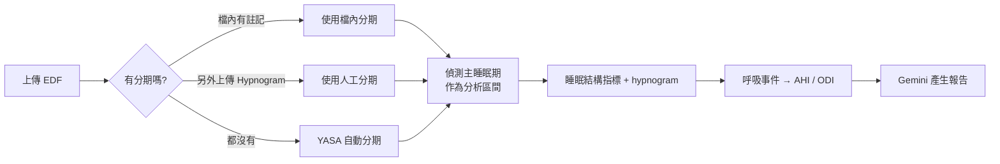

# 🌙 睡眠分析報告產生器

Streamlit 應用程式：上傳睡眠數據，用 Gemini 自動產生繁體中文的睡眠分析報告。

支援兩種輸入：

| 輸入 | 適用情境 | 分析內容 |
|---|---|---|
| **表格檔**（CSV / Excel / JSON） | 手環、手錶等穿戴裝置匯出的多天紀錄 | 跨日趨勢、平均睡眠時數、深睡佔比、睡眠分數 |
| **PSG 原始檔**（EDF / EDF+ / BDF） | 睡眠檢查室或研究資料（例如 Sleep-EDF） | 單晚睡眠結構、hypnogram、呼吸事件與 AHI |

---

## 安裝

```bash
git clone git@github.com:Brianbrain/sleep-report.git
cd sleep-report
pip install -r requirements.txt
```

需要 Python 3.10 以上。`yasa` 與 `pytest` 是選用的：沒有 `yasa` 時 app 照常運作，
只是不會出現自動睡眠分期功能。

## 設定 Gemini API Key

三種方式擇一（讀取優先序：側邊欄 → 環境變數 → secrets 檔）：

```bash
export GEMINI_API_KEY="your-key"
```

```toml
# .streamlit/secrets.toml
GEMINI_API_KEY = "your-key"
```

或直接在 app 側邊欄的密碼欄位貼上。金鑰不會寫進任何檔案。

## 執行

```bash
streamlit run sleep_report.py
```

預設開在 <http://localhost:8501>；port 被佔用時用 `--server.port 8531` 換一個。

---

## 表格檔流程

1. 上傳 CSV / Excel / JSON（CSV 會自動嘗試 utf-8 / big5 / cp950 編碼）
2. App 依關鍵字自動辨識欄位（日期、總睡眠、深睡、淺睡、REM、清醒、分數、心率），中英文皆可，辨識錯了可在畫面上手動改
3. 看趨勢圖與階段分佈圖，按下產生報告

睡眠長度欄位不必先整理格式，以下都會被正確解讀：

| 寫法 | 解讀 |
|---|---|
| `450` | 450 分鐘 |
| `7.5` | 7.5 小時（≤24 一律視為小時） |
| `7h30m` / `7:30` / `7 小時 30 分` | 450 分鐘 |

側邊欄有「下載範例 CSV」可以直接試用。

## EDF / PSG 流程



**分期來源優先序**：另外上傳的 Hypnogram 檔 > EDF 檔內註記 > YASA 自動分期。
畫面上會標明目前用的是哪一種。

**分析區間**：連續 24 小時的記錄（例如 Sleep-EDF 從下午就開始錄）含大量白天清醒時間，
直接算睡眠效率會失真。App 會以 30 分鐘滑動視窗找出睡眠密度最高的連續區段當作預設分析區間，
可用 slider 手動調整。以 Sleep-EDF SC4002 為例，睡眠效率會從失真的 32.8% 回到 93.7%。

**自動分期**：使用 [YASA](https://yasa-sleep.org/) 的預訓練模型，需要一個 EEG 通道
（中央導程 C3/C4 效果最好），EOG、EMG、年齡、性別為選填但能提高準確度。
輸出機率會做 5 個 epoch 的三角平滑以減少孤立誤判。23 小時的記錄約需 20–60 秒。

> ⚠️ 自動分期是演算法推估，與人工判讀會有差異。以 Sleep-EDF SC4002 實測，
> epoch 一致率約 82%，TST 比人工分期多約 1 小時（自動分期把入睡前的安靜清醒算成睡眠）。
> 畫面與報告都會標示分期來源與平均信心。

### 計算的指標

| 指標 | 說明 |
|---|---|
| TST | 總睡眠時間 |
| SPT | 睡眠期間，首次入睡到最後醒來 |
| 睡眠維持效率 | TST / SPT |
| WASO | 入睡後的清醒時間 |
| REM 潛伏期 | 首次入睡到第一個 REM |
| 各期時間與佔 TST 比例 | N1 / N2 / N3 / REM |
| 覺醒次數、覺醒指數 | SPT 內的連續清醒段落 |
| 階段轉換次數、片段化指數 | 睡眠穩定度 |
| **AHI** | (呼吸中止 + 低通氣) / TST 小時 |
| **ODI** | 血氧下降事件 / TST 小時 |
| **腦波覺醒指數** | 註記的 arousal / TST 小時 |
| 血氧平均 / 最低 / T90 | 有 SpO2 通道時計算 |

呼吸事件來自 EDF+ 註記（阻塞型 / 中樞型 / 混合型呼吸中止、低通氣、血氧下降、覺醒、
打鼾、肢體運動）。註記中沒有血氧事件但有 SpO2 通道時，會直接從訊號偵測 ≥3%、持續 ≥10 秒的下降。

AHI 分級（<5 正常、5–15 輕度、15–30 中度、≥30 重度）只是參考區間，**不是診斷**。

### 分期檔格式

除了 EDF+ 的 Hypnogram 檔，也接受 CSV / TSV / TXT，需要包含 onset 與 stage 欄位：

```csv
onset,duration,stage
25800,30,Sleep stage 2
25830,30,Sleep stage 3
25860,20,Obstructive apnea
```

分期標籤支援 Sleep-EDF（`Sleep stage W/1/2/3/4/R`）、AASM（`N1`/`N2`/`N3`/`REM`）與
YASA（`WAKE`/`REM`）等寫法；分期檔的起始時間若與訊號檔不同，會自動對齊。

---

## 專案結構

```
sleep_report.py          Streamlit UI：表格檔與 EDF 兩條流程，共用報告產生區塊
edf_utils.py             EDF 解析、睡眠結構指標、YASA 自動分期、呼吸事件計算
tests/test_edf_utils.py  單元測試
requirements.txt
```

## 測試

```bash
python3 -m pytest tests/ -q
```

呼吸事件與血氧偵測用合成資料驗證；睡眠結構指標以 Sleep-EDF 的
`SC4002EC-Hypnogram.edf` 當回歸基準（該檔不存在時會自動 skip）。

## 免責聲明

本工具產生的內容由 AI 依據上傳數據撰寫，僅供健康資訊參考，
**不能取代醫師診斷或睡眠技師的判讀**。若有睡眠障礙疑慮請就醫評估。
